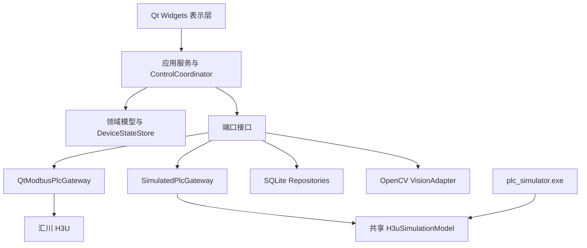

# PLC 上位机架构设计规范

- 日期：2026-09-02
- 状态：架构设计与书面 spec 已确认
- 目标平台：Windows x64，1920×1080 触摸屏兼容鼠标
- PLC：汇川 H3U，Modbus RTU 从站
- 客户端技术：C++20、Qt 6.8、Qt Widgets、CMake、SQLite、OpenCV 4.x

## 1. 背景与需求来源

本项目从零开发一套单机离线 PLC 上位机。当前项目没有既有代码和构建系统，原始需求来自：

- `需求/PLC上位机地址及要求.txt`
- `需求/补充.txt`
- `需求/界面布局参考/` 下的 7 张 HMI 参考图

若原始文档之间存在冲突，本文中已经确认的决策优先，其次采用补充文档，最后采用主需求文档。具体冲突已经在“已确认的需求决策”中消解。

## 2. 目标

系统必须完成以下目标：

1. 通过 Modbus RTU 稳定连接汇川 H3U PLC，展示设备实时状态并执行受控命令。
2. 完成复位、回原点、配方选择、调宽、自动启动、停止、软件急停、手动点动和安全屏蔽等业务流程。
3. 提供配方、报警历史、操作审计、用户和设置的单机持久化。
4. 提供操作员和管理员两级权限，危险操作必须经过统一权限与互锁校验。
5. 在没有真实 PLC 的开发和软件验收阶段，通过进程内模拟器和独立 Modbus RTU 从站模拟器完成测试。
6. 隔离 OpenCV 视觉模块。第一期引入并验证 OpenCV，但不让视觉结果参与 PLC 控制闭环。
7. 保证 UI、数据库和通讯职责分离，任何串口或数据库等待都不得阻塞 UI 线程。

## 3. 非目标

第一期不包含以下能力：

- 不直接控制相机，不实现相机预览、采图、算法判断或视觉结果与 PLC 握手。
- 不提供中心服务器、多设备集中管理、云同步或远程控制。
- 不保存 250 ms 级连续遥测历史，只保存报警边沿、用户操作和配置变更。
- 不替代物理急停、安全门、光栅和 PLC 安全逻辑。软件急停不是安全等级急停。
- 不解释未提供位定义的 D102、D104、D105，只在诊断页显示其原始值。
- 上位机不计算或修正手动调宽后 D130 的位置变化。D130 的正确性由 PLC 负责，此项不纳入第一期软件模拟验收。

## 4. 已确认的需求决策

| 主题 | 决策 |
|---|---|
| 部署 | Windows 单机离线应用，本地 SQLite，无服务端依赖 |
| UI | Qt Widgets，1920×1080 横屏，触摸和鼠标均可操作 |
| Qt 授权 | LGPLv3 动态链接；发行包必须满足可替换动态库及许可证要求 |
| 调宽触发 | 写入 D128 并读回确认后，发送 M43 的 100 ms 脉冲；不采用“写 D128 自动调宽” |
| 宽度精度 | 整数毫米，D128/D130 范围 50-400 mm |
| 调宽结果 | M44/M45 是互斥结果位，每次 M43 上升沿先清零，M103 也清零 |
| 调宽超时 | PLC 按距离和速度动态计算，HMI 等待时间比 PLC 多 3 秒 |
| 定位算术 | 16 位宽度使用有符号 SUB；脉冲使用 MUL 生成 D136/D137，禁止 DSUB/DMUL 覆盖相邻寄存器 |
| 配方 | 只保存唯一名称和目标宽度；选择仅加载，明确确认后才写 PLC 并调宽 |
| 权限 | 操作员、管理员两级；未登录也可在线停止和置软件急停 |
| 通讯中断 | 所有写操作禁用并显著报警，由 PLC 独立安全逻辑处置设备，不排队重放命令 |
| PLC 看门狗 | 新增 M112，由 HMI 每 500 ms 翻转；2 秒无边沿时 PLC 清持续命令和安全屏蔽 |
| 相机 | 只监视 PLC 提供的 M11/M12；引入 OpenCV 并预留 IVisionService |
| 数据保留 | 报警和审计默认保留 365 天，活动报警不得清理 |
| 验收顺序 | 构建/静态检查 → 单元测试 → Code Review → 集成测试 → 模拟 PLC RTU 验收 → 真实 H3U 现场 SAT |

## 5. 总体架构

采用单进程模块化单体和端口-适配器边界。生产程序只有一个主可执行文件，独立 PLC 模拟器是开发和验收工具。



依赖规则：

- UI 只能提交用户意图并订阅状态，不得拼接 Modbus 地址或执行 SQL。
- 应用层负责权限、前置条件、流程编排和结果收敛。
- 领域层保存与 Qt Widgets、串口、数据库无关的值对象、地址定义和规则。
- 端口接口隔离真实 PLC、模拟 PLC、SQLite 和 OpenCV。
- 适配器可以替换，但不得把具体库类型泄漏到领域层和 UI。

## 6. 模块与构建目标

| 目标 | 责任 | 主要依赖 |
|---|---|---|
| `hlm_core` | 地址表、快照解码、领域规则、应用服务、端口接口和密码派生 | Qt Core、OpenSSL Crypto |
| `hlm_modbus` | RTU 客户端、串行请求队列、轮询、脉冲和重连 | Qt SerialBus、Qt SerialPort |
| `hlm_sqlite` | 数据库线程、迁移和仓储实现 | Qt Sql |
| `hlm_simulator` | 共享 H3U 模型和进程内 PLC 网关 | Qt Core |
| `hlm_vision` | IVisionService 的 OpenCV 实现和自检 | OpenCV Core |
| `hlm_ui` | 主窗口、页面、模型、通用工业控件和主题 | Qt Widgets |
| `hlm_app` | 组合根、配置加载、线程启动和应用生命周期 | 上述生产模块 |
| `plc_simulator` | 独立 RTU 从站和故障注入控制面板 | Qt SerialBus、Qt SerialPort、Qt Widgets、`hlm_simulator` |

`HLM_ENABLE_VISION` 是独立 CMake 选项，默认开启。软件验收发行包必须开启并完成 OpenCV 版本和基础矩阵运算自检；视觉模块初始化失败不得影响 PLC 控制模块启动。

建议源代码边界：

```text
src/
  common/
  domain/
  application/
  ports/
  adapters/modbus/
  adapters/sqlite/
  adapters/simulator/
  adapters/vision/
  ui/pages/
  ui/widgets/
tools/plc_simulator/
tests/unit/
tests/integration/
```

## 7. 线程模型

### 7.1 UI 主线程

UI 主线程拥有所有 QWidget、页面模型、`DeviceStateStore` 和 `ControlCoordinator`。它只接收完整状态快照和异步结果，不调用阻塞串口或 SQL API。

### 7.2 PLC 工作线程

PLC 工作线程创建并独占 `QModbusRtuSerialClient`、请求队列、轮询定时器、脉冲状态机、重连定时器和 M112 心跳定时器。Modbus 对象不得跨线程创建后移动使用。

M112 必须由 PLC 工作线程驱动，不能依赖 UI 事件循环，否则模态窗口或 UI 卡顿可能误触发 PLC 看门狗。

### 7.3 SQLite 工作线程

SQLite 工作线程创建并独占一个 `QSqlDatabase` 连接。全部仓储操作、迁移和保留期清理在该线程串行执行。连接不得跨线程共享。

数据库启用 WAL、外键约束和 busy timeout。UI 查询同样通过异步仓储接口执行，第一期不增加第二个 UI 只读连接。

### 7.4 视觉线程

第一期 OpenCV 自检工作量很小，可以在视觉适配器自己的工作线程执行。未来相机采集和算法处理必须继续留在该线程，不能进入 PLC 工作线程。

### 7.5 跨线程数据

跨线程仅传不可变值对象、命令 DTO 和结果事件。不得共享可变容器、数据库连接、Modbus Reply 或 QWidget 指针。

## 8. PLC 通讯契约

### 8.1 串口配置

| 参数 | 默认值 | 可配置范围 |
|---|---:|---|
| 协议 | Modbus RTU | 固定 |
| PLC 角色 | 从站 | 固定 |
| 站号 | 1 | 1-247 |
| 波特率 | 9600 | 9600、19200 |
| 数据位 | 8 | 固定 |
| 停止位 | 1 | 1、2 |
| 校验 | 无 | 无、奇、偶 |
| 地址表示 | 0 基协议地址 | 固定 |

默认数据格式是 8N1。COM 口、站号、波特率、停止位、校验、超时和读重试次数由管理员配置。修改通讯配置必须断开后重连并写入审计。

### 8.2 地址源与类型

实现中必须用一个集中 `AddressTable` 定义地址、访问类型、数值类型、范围、缩放和文字说明。UI 和流程代码不得出现散落的裸地址数字。

关键解码规则：

- D100 bit0-bit14 对应 M0-M14，bit15 保留。
- D103 bit0-bit15 对应 M30-M45，因此 M34/M42/M43/M44/M45 分别是 bit4/bit12/bit13/bit14/bit15。
- M50-M53 通过功能码 01 独立读取，用于显示和校验回原点过程。
- D102、D104、D105 因缺少位定义，只作为 `uint16` 原始诊断值。
- D110 是 `uint16` 故障代码，合法 PLC 代码为 0-10，未知非零代码按未知锁存故障处理。
- D120、D122、D128、D130、D140、D204、D220 按 `uint16` 解码。
- D126 是低字、D127 是高字，连续读取并组合成 `uint32` 调宽脉冲频率。`DDRVI D136 D126 Y0 Y3` 会把 D126/D127 作为 32 位 S2 操作数。
- D210 是目标减当前，按 `int16` 解码。
- D136 是低字、D137 是高字，连续读取并组合成 `int32` 相对定位脉冲数。
- D138 是低字、D139 是高字，连续读取并组合成 `uint32` 累计产量。
- D140 按“值是否发生变化”检测活性，不要求单调增加，因此自然支持 16 位回绕。

真实 H3U 现场 SAT 必须再次确认 0 基地址、D136/D137 和 D138/D139 字序。解码必须集中，以便现场只修改一处定义。

### 8.3 轮询计划

| 周期 | 请求 | 用途 |
|---:|---|---|
| 名义 250 ms | 功能码 03 连读 D100-D140 | 状态字、故障、步骤、速度、宽度、脉冲、产量、PLC 心跳 |
| 名义 250 ms | 功能码 01 连读 M50-M53 | 回原点执行状态和阶段诊断 |
| 名义 500 ms | 功能码 01 连读 M100-M112 | 保持命令、脉冲清零和 HMI 心跳回读 |
| 名义 1000 ms | 功能码 03 连读 D204-D223 | 脉冲当量、差值、调宽速度和动态超时诊断值 |

在 9600 波特率下，以上基础轮询和 M112 写入约占六成总线时间。250 ms 是名义调度周期，不是硬实时截止时间。写命令和脉冲清零可以让某次轮询延后，但正常通讯下不得让快速状态快照连续超过 1 秒未更新。

同一时刻最多存在一个 RTU 请求。优先级从高到低为：

1. 已置位脉冲的清零请求。
2. 在线停止、软件急停置位和持续运动命令清零。
3. M112 心跳翻转。
4. 其他用户写命令及写后读回。
5. 快速状态轮询。
6. 命令位回读。
7. 慢速参数轮询。

低优先级轮询必须采用防饥饿调度，正常通讯下快速状态快照不能被连续写请求永久推迟。

### 8.4 请求失败与重试

- 读请求允许配置一次自动重试。
- 脉冲置 1 写请求超时后结果不确定，不得盲目重发置 1。系统先回读目标位并优先确保其为 0，再依据 M3、M44、M45、M61 等实际状态收敛。
- 保持型写入先读回确认。目标值已经生效时视为成功；未生效时才允许按策略重试。
- M100=1 是幂等安全写，可在连接仍有效时重试，但 UI 必须显示尚未确认，直到 M0=1 或读回 M100=1。
- 三次连续传输失败，或 D140 超过 3 秒不变化，连接进入离线态。
- 离线后按 1 秒、2 秒、5 秒退避重连，之后每 5 秒重试。
- 重连后必须先取得一份完整有效快照，才恢复非安全控制；任何离线期间命令都不得排队重放。

### 8.5 脉冲命令

M101、M102、M103、M43 使用统一脉冲状态机：

1. 串行写 1。
2. 收到写 1 成功应答后开始计时。
3. 保持高电平至少 100 ms。
4. 将写 0 请求放到队列最高优先级。
5. 收到清零应答或回读为 0 后完成脉冲。

禁止用阻塞 sleep 实现脉冲。队列繁忙可以延长高电平，但不能短于 100 ms。真实 H3U SAT 必须确认 PLC 扫描周期能够可靠识别该脉冲。

### 8.6 新增 M112 HMI 看门狗

M112 是 HMI 写、PLC 读的保持位。HMI 在连接有效时每 500 ms 翻转一次。

PLC 若连续 2 秒没有检测到 M112 边沿，必须：

- 清除 M42、M106、M107、M108、M109、M110、M111。
- 恢复门磁和光栅保护。
- 不自动清除 M100 软件急停。
- 不因 HMI 心跳丢失而强制解除 M104/M105；自动流程是否继续由 PLC 既有安全逻辑和物理互锁决定。

M112 回读不用于判断 PLC 活性，因为 500 ms 翻转和 500 ms 回读可能发生混叠。PLC 活性以 D140 为主。

## 9. 设备状态与数据质量

`DeviceSnapshot` 是一次完整解码后的不可变设备快照，至少包含：

- 采集开始和完成时间、快照序号、连接状态、数据年龄和整体质量。
- D100-D105 原始状态字及所有已定义的布尔状态。
- 故障代码、当前步骤、皮带速度、32 位调宽频率、目标宽度、当前宽度和调宽差值。
- 32 位调宽脉冲、32 位产量、PLC 心跳、脉冲当量和调宽速度。
- M50-M53 回原点过程位和 M100-M112 命令位回读。
- 每个来源块的有效、过期、协议异常或越界质量。

`DeviceStateStore` 只原子替换完整快照，不逐字段发布半更新状态。UI 不得用旧数值冒充实时值；字段过期或无效时显示“—”，并禁用依赖该字段的动作。

## 10. 控制流程

### 10.1 模式切换

- M104=0 为手动模式，M104=1 为自动模式。
- 独立模式切换只允许管理员执行。
- M3=1 自动运行时禁止切换模式，必须先停止并确认 M3=0。
- 操作员的“启动”不会隐式写 M104；系统必须已经处于自动模式。

### 10.2 复位与回原点

前置条件：在线、管理员登录、M3=0。

流程：

1. 若不是手动模式，写 M104=0 并等待 M1=1。
2. 发送 M103 脉冲。
3. 显示回原点中，监视 M50。
4. 以 M61=1 且 M50=0 作为成功结果。
5. HMI 防御性等待超时默认 120 秒，管理员可在 30-600 秒范围内配置。
6. 若 PLC 报故障或 HMI 等待超时，保留实际状态并给出处置提示，不显示乐观成功；HMI 超时不伪造 PLC 故障代码。

M103 同时清除 M44 和 M45。

### 10.3 配方与自动调宽

选择配方只把名称和目标宽度加载到界面，不立即写 PLC。管理员点击“应用并调宽”并确认后执行：

1. 校验在线、M34=0、手动模式 M1=1、已回原点 M61=1、未运行 M3=0、无急停 M0=0、无锁存故障 M14=0、未回原点中 M50=0、目标宽度 50-400，并满足 `1 <= D204 <= 32767`、`1 <= D220 <= 15`、`10 <= D204 * D220 <= 200000`。
2. 写 D128，并读回确认等于目标值。
3. 若目标宽度等于当前宽度，显示“当前已是目标宽度”并结束，不发送 M43。
4. 发送 M43 脉冲，并在应用层保存本次命令的目标宽度、起始当前宽度和调宽速度。
5. 只接受脉冲应答后的新快照作为本次结果。
6. M34=1 表示正在调宽；此时禁止再次写 D128 或发送 M43。
7. M34=0、M44=1、M45=0 且 D130 等于本次命令保存的目标宽度表示成功。
8. M34=0、M44=0、M45=1 表示失败。

PLC 的 M43/M44/M45 契约：

- 每次 M43 上升沿先保存“命令到达时是否正在调宽”，再清 M44、M45。
- 调宽中再次收到 M43 时，中止本次定位并只置 M45；正常 HMI 不会发送该命令。
- 前置条件不满足时，只置 M45，不置 M44。
- 前置条件满足时置 M34 并开始定位。
- 定位开始时锁存 D128，后续计算和完成更新都使用锁存值，避免运行期间 D128 被外部修改。
- 定位成功时清 M34，只置 M44，并更新 D130=锁存目标。
- 定位失败或超时时清 M34，只置 M45。
- M44 和 M45 在任何稳定状态下不得同时为 1。
- 若 D128=D130，PLC 把错误发送的 M43 判为无效命令并只置 M45；正常 HMI 在发送前按“无需调宽”处理。

调宽超时由 PLC 计算：

```text
plc_timeout_s = clamp(ceil(abs(command_target - start_width) / max(command_speed, 1)) + 5, 10, 360)
hmi_timeout_s = plc_timeout_s + 3
```

PLC 超时时置 M45=1、M14=1、D110=10。故障代码 10 的中文含义是“调宽定位超时”。

#### 10.3.1 修正后的 H3U 参考指令

原指令中的 `DSUB D128 D130 D210` 会把 D128/D129 和 D130/D131 当作 32 位源；`DMUL D210 D204 D136` 会生成 64 位结果并占用 D136-D139，从而覆盖 D138/D139 产量。宽度和脉冲当量均为 16 位数据，因此必须使用有符号 `SUB` 和 `MUL`。同理，D130 是 16 位宽度，完成时使用 `MOV`，不能使用会同时覆盖 D131 的 `DMOV`。

新增内部位和工作寄存器必须由 PLC 工程师确认未被现有程序占用：

| 地址 | 用途 |
|---|---|
| M46 | M43 上升沿的一扫描命令脉冲 |
| M47 | 本次 M43 命令前置条件有效脉冲 |
| M48 | M43 到达时 M34 已经为 1 的忙状态快照 |
| M49 | 调宽运行期间的连续安全互锁汇总 |
| D212 | 本次调宽锁存目标，16 位 |
| D213 | 调宽距离绝对值，16 位 |
| D214 | 向上取整除法的分子，16 位 |
| D216/D217 | DIV 的商/余数 |
| D218 | PLC 动态超时秒数，10-360 |
| D222/D223 | T6 预置值，单位 100 ms；D222 最大 3600，D223 为 0 |

以下指令是本 spec 的参考实现。最终下载前仍须在实际 H3U 工程中核对 M46-M49、D212-D218、D222-D223 与其他程序的占用关系。

```text
// 复位命令同步清除调宽状态
LDP        M103
RST        M34
RST        M44
RST        M45
RST        T6

// D210 始终表示实时目标减当前；D126/D127 始终保持 32 位频率
LD         M8000
SUB        D128 D130 D210
LD         M8000
AND>=      D204 K1
AND<=      D204 K32767
AND>=      D220 K1
AND<=      D220 K15
MUL        D220 D204 D126

// 调宽运行期间的连续安全互锁
LD         M1
AND        M61
ANI        M3
ANI        M0
ANI        M14
ANI        M50
AND        X10
AND        X12
OUT        M49

// 捕获 M43 上升沿及命令到达时的忙状态
LDP        M43
OUT        M46
LD         M46
AND        M34
OUT        M48

// 每个新命令先清除旧结果和旧定时器
LD         M46
RST        M44
RST        M45
RST        T6

// 汇总本次命令的启动条件
LD         M46
ANI        M48
AND        M49
AND>=      D128 K50
AND<=      D128 K400
AND>=      D204 K1
AND<=      D204 K32767
AND>=      D220 K1
AND<=      D220 K15
ANDD>=     D126 K10
ANDD<=     D126 K200000
AND<>      D128 D130
OUT        M47

// 调宽中重复启动：安全中止，不启动第二次定位
LD         M46
AND        M48
SET        M45
RST        M34

// 非忙但前置条件无效
LD         M46
ANI        M48
ANI        M47
SET        M45
RST        M34

// 有效命令：锁存目标并计算差值
LD         M47
MOV        D128 D212
LD         M47
SUB        D212 D130 D210

// 绝对距离，用于动态超时；NEG 为单操作数原地求补
LD         M47
MOV        D210 D213
LD         M47
AND<       D213 K0
NEG        D213

// ceil(abs(diff) / speed) + 5 秒
LD         M47
ADD        D213 D220 D214
LD         M47
SUB        D214 K1 D214
LD         M47
DIV        D214 D220 D216
LD         M47
ADD        D216 K5 D218

// 超时限制为 10-360 秒
LD         M47
AND<       D218 K10
MOV        K10 D218
LD         M47
AND>       D218 K360
MOV        K360 D218

// T6 为 100 ms 定时器；脉冲数为有符号 16x16 -> 32 位
LD         M47
MUL        D218 K10 D222
LD         M47
MUL        D210 D204 D136
LD         M47
SET        M34

// 运行中互锁丢失时中止，已有 PLC 故障代码不被覆盖
LD         M34
ANI        M49
RST        M44
SET        M45
RST        M34
RST        T6

// M34 必须保持到 M8029 定位完成
LD         M34
DDRVI      D136 D126 Y0 Y3

// 正常完成优先于同一扫描周期的超时处理
LD         M34
AND        M8029
MOV        D212 D130
SUB        D128 D130 D210
RST        M34
RST        T6
RST        M45
SET        M44

// 动态超时
LD         M34
OUT        T6 D222
LD         T6
RST        M44
SET        M45
RST        M34
RST        T6
SET        M14
MOV        K10 D110
```

H3U 官方指令语义依据：M8000 在用户程序 RUN 时保持 ON；`SUB` 是有符号 16 位减法；`MUL` 是有符号 16×16 并写两个目标寄存器；`DDRVI` 的 S1、S2 都使用相邻双寄存器；T6 属于 100 ms 定时器并支持数据寄存器间接预置；DDRVI 驱动条件必须保持到 M8029 完成。

### 10.4 自动启动

启动允许操作员和管理员执行。前置条件：在线、自动模式 M2=1、自动准备 M60=1、无急停 M0=0、无锁存故障 M14=0、当前未运行 M3=0。

发送 M101 脉冲后，只有观察到 M3=1 才显示启动成功。条件不满足时在按钮旁显示具体互锁原因。

### 10.5 停止

在线时，未登录用户、操作员和管理员都可以停止。停止按钮单击立即发送 M102 脉冲，不显示确认框。只有 M3=0 后才显示已停止。

离线时不尝试发送，也不排队；界面明确提示“通讯中断，命令无法送达，请使用现场停止或实体急停”。

### 10.6 软件急停

在线时，任何用户均可立即写 M100=1，不要求登录或确认。按钮必须与普通操作分离，使用固定红色危险样式。软件急停置位后保持，不能因程序重启、重连、注销或 M112 超时自动清除。

只有管理员可明确执行 M100=0。解除前必须确认物理故障源已经排除，并再次确认操作。解除请求成功不等于设备可运行，后续仍以 M0、M14、M60 等 PLC 状态为准。

离线时软件急停命令无法送达，界面必须提示使用实体急停。产品文案不得把软件急停描述为安全等级急停。

### 10.7 手动命令

M106、M107、M108 是按住写 1、松开写 0 的持续命令。M109 是保持型挡停命令。全部只允许管理员，并要求手动模式、M61=1、M3=0、无急停和无锁存故障。

UI 在以下情况必须立即请求清零持续命令：

- 鼠标或触摸释放。
- 指针移出后释放。
- 窗口失活。
- 页面切换。
- 模态窗口弹出。
- 用户注销或会话超时。
- 应用正常退出。

通讯突然中断时 HMI 清零可能无法送达，PLC 的 M112 看门狗是最终兜底。第一期不通过重复写 1 维持点动，以减少总线负载。

### 10.8 直通、皮带常转和安全屏蔽

M105 直通模式、M42 皮带常转、M110 光栅屏蔽、M111 门磁屏蔽只允许管理员修改并写入审计。

安全屏蔽必须二次确认，生效期间顶部持续显示琥珀色横幅。用户注销或会话超时时，HMI 尝试清除 M42、M106-M111；通讯中断时由 PLC M112 看门狗清除。M105 模式选择保持不变。

## 11. UI 设计

### 11.1 应用外壳

应用采用全屏布局并以 1920×1080 为基准，使用 Qt Layout 管理，不使用绝对坐标。必须在 Windows 100%、125%、150% 缩放下检查无关键控件截断。

整体区域：

- 顶部状态条约 72 px：应用名、PLC 在线、手/自动、运行、回原点、准备、故障/急停、当前用户、时间。
- 顶部报警横幅约 40 px：无报警时显示绿色“无报警”，有报警时显示最高优先级当前报警。
- 左侧导航约 176 px：总览、配方与调宽、手动控制、报警、操作记录、I/O 与诊断、用户与设置。
- 中央内容区自适应剩余空间。
- 右侧固定操作栏约 192 px：手动、自动、启动、停止、复位、登录/注销和独立软件急停。

所有主要触摸目标不得小于 48×48 px，主要控制按钮建议不小于 72 px 高。表格行高不得小于 48 px。

### 11.2 通用状态语义

| 状态 | 视觉语义 | 文案 |
|---|---|---|
| 在线/完成/准备 | 绿色 | 在线、已回原点、准备完成 |
| 自动模式/命令发送中 | 蓝色 | 自动、发送中、等待 PLC 确认 |
| 手动/屏蔽/警告 | 琥珀色 | 手动、已屏蔽、未准备 |
| 故障/急停 | 红色 | 故障、急停、命令失败 |
| 离线/未知/过期 | 灰色和斜纹 | 通讯中断、模式未知、— |

颜色不是唯一信息通道，所有状态必须同时有文字和图标。故障和急停可以使用统一 1 Hz 视觉提示，但不得让整个页面高频闪烁。

命令不得乐观更新状态。启动等待 M3，复位等待 M61，调宽等待 M44/M45，模式切换等待 M1/M2，保持写等待位或映射状态回读。

### 11.3 页面职责

| 页面 | 内容和主要操作 |
|---|---|
| 总览 | 关键状态、设备示意、D120 当前步骤、目标/当前宽度、差值、皮带速度、累计产量、最新报警 |
| 配方与调宽 | 配方列表、名称和宽度编辑、D128/D130/D210、调宽状态、应用并调宽 |
| 手动控制 | 皮带点动、调宽正反转、挡停、D220、M42、M105、M110、M111；操作员只读 |
| 报警 | 当前 PLC/HMI 报警和历史发生/恢复记录，支持日期和代码筛选 |
| 操作记录 | 时间、用户、角色、动作、对象、脱敏参数、结果和失败原因筛选 |
| I/O 与诊断 | D100-D105、M50-M53、M100-M112、关键寄存器、心跳、延迟、错误统计、OpenCV 版本和自检 |
| 用户与设置 | 用户增删改密、串口配置、超时重试、保留期、D122/D204/D220 管理员参数 |

D204 脉冲当量必须单独显示“非专业人员勿修改”，修改时要求再次输入管理员密码、按有符号 MUL 范围 1-32767 脉冲/mm 校验、写后读回和审计。还必须满足 `10 <= D204 * D220 <= 200000`，以符合 DDRVI 频率范围。物理可用值由机械设计决定，软件模拟验收只使用默认值 1280，其他值必须在真实设备 SAT 中确认。

### 11.4 权限矩阵

| 能力 | 未登录 | 操作员 | 管理员 |
|---|---:|---:|---:|
| 查看总览、报警、记录和诊断 | 是 | 是 | 是 |
| 在线停止 | 是 | 是 | 是 |
| 在线置软件急停 | 是 | 是 | 是 |
| 启动 | 否 | 是 | 是 |
| 模式切换、复位、解除软件急停 | 否 | 否 | 是 |
| 配方增删改、应用调宽 | 否 | 否 | 是 |
| 手动、直通、常转和安全屏蔽 | 否 | 否 | 是 |
| 用户、通讯和参数设置 | 否 | 否 | 是 |

无权限操作应保持可发现但禁用，并在相邻位置或提示框说明所需权限和互锁原因。用户与设置页对未登录和操作员显示锁定面板，不展示敏感字段。

### 11.5 会话

- 首次启动强制创建管理员，不提供硬编码默认密码。
- 密码使用 OpenSSL 3.x `PKCS5_PBKDF2_HMAC` 实现 PBKDF2-HMAC-SHA256，采用 16 字节独立随机盐、32 字节派生结果和版本化参数；默认 600,000 次迭代，禁止自定义密码算法和明文存储。
- 同一账号连续 3 次失败登录后锁定该账号 30 秒，并记录失败审计，但不得记录密码；其他账号不受该锁定影响。
- 默认 15 分钟无操作自动注销，提前 60 秒提示。
- 注销触发 M42、M106-M111 清零流程。

## 12. 本地数据设计

默认机器级数据目录是 `%ProgramData%\PLC-HLM\`，安装程序为运行账户配置最小必要写权限。

| 表 | 关键字段和约束 |
|---|---|
| `schema_migrations` | version 唯一、applied_at、checksum |
| `users` | id、username 唯一、role、password_hash、salt、parameters、enabled、created_at、updated_at |
| `recipes` | id、name 唯一、target_width_mm 50-400、created_by、updated_by、created_at、updated_at |
| `alarm_events` | id、source、code、message_snapshot、severity、started_at、ended_at、snapshot_sequence |
| `audit_log` | id、occurred_at、user_id/匿名、role、action、target、redacted_parameters、result、reason |
| `app_settings` | key 唯一、typed_value、updated_by、updated_at |

PLC 报警和 HMI 系统报警使用不同 source。HMI 系统报警至少包含通讯中断、PLC 心跳冻结、回原点等待超时、数据库受限模式和视觉模块不可用。

报警边沿规则：

- D110 从 0 变为非零，或非零代码发生变化时，结束旧事件并开始新事件。
- D110 归零且 M14/M4 均清除时，结束当前 PLC 报警事件。
- 未知非零代码照常保存原始值和通用文字。
- 不提供没有 PLC 地址支撑的“报警确认”语义，只区分活动和已恢复。

报警与审计默认保留 365 天。每日低负载时清理已结束报警和过期审计；活动报警永不清理。轮询快照不落库。

诊断日志采用滚动文件，默认最多 10 个文件、每个 10 MiB。日志不得包含密码、密码摘要、完整敏感配置或未脱敏的用户输入。

## 13. 错误处理与降级

| 异常 | 系统行为 | 恢复条件 |
|---|---|---|
| 串口超时、CRC、端口断开 | 三次失败后离线，全部写操作禁用，不重放命令 | 重连并取得完整有效快照 |
| D140 超过 3 秒不变 | 判定 PLC 数据失效，即使串口仍返回数据 | D140 再次变化且完整快照有效 |
| 写结果不确定 | 显示待确认，回读并向安全状态收敛 | 状态或位回读明确 |
| 数值越界或状态矛盾 | 字段无效，禁用依赖动作，保存原始诊断 | 后续有效快照 |
| 未知故障代码 | 按锁存故障处理并显示原始代码 | PLC 清故障 |
| 数据库迁移/写入失败 | 受限模式；只保留在线停止和置软件急停 | 修复存储后重启，迁移事务成功 |
| OpenCV 初始化失败 | 视觉诊断标红，PLC 控制继续可用 | 视觉模块重新初始化成功 |

应用正常退出时尝试清除 M42、M106-M111，然后停止 M112 并断开串口。异常退出时依赖 PLC M112 看门狗。M100 在任何退出路径都不得自动清除。

## 14. 模拟器设计

### 14.1 共享 H3uSimulationModel

进程内模拟器和独立 RTU 模拟器必须复用同一个 `H3uSimulationModel`，不能各自实现 PLC 业务，以免行为漂移。

共享模型至少模拟：

- 全部已定义 M 位和 D 寄存器。
- D140 每秒递增和 16 位回绕。
- 复位、M50、M61 和故障 8/9。
- D128 写入、M43/M34/M44/M45、动态调宽超时和故障 10。
- M46-M49、D212-D218、D222-D223 的命令锁存、互锁、绝对距离和动态超时计算。
- 自动准备 M60、启动 M101、运行 M3、停止 M102。
- M104 与 M1/M2 的互斥模式切换，以及运行中拒绝切换。
- M105 直通、M42 皮带常转、M106-M108 点动和 M109 挡停的命令与状态映射。
- M100 软件急停及故障锁存。
- M112 两秒看门狗和清位规则。
- 调宽成功、前置条件失败、定位超时、通讯延迟、断线、异常响应、非法值和心跳冻结。

### 14.2 进程内 SimulatedPlcGateway

`SimulatedPlcGateway` 实现 `IPlcGateway`，直接包装共享模型，用于快速、确定性的应用和 UI 集成测试。模型支持注入时钟和显式推进时间，避免测试依赖真实等待。

### 14.3 独立 plc_simulator.exe

独立模拟器用 `QModbusRtuSerialServer` 包装共享模型，通过 Windows 虚拟 COM 对与生产 `QtModbusPlcGateway` 通讯。服务端必须配置明确站号，不能使用响应全部站号的配置掩盖寻址错误。

模拟器提供最小控制面板，用于选择成功、条件失败、超时、故障代码、断线、延迟、异常响应、非法值和心跳冻结场景，并显示收到的请求和当前寄存器状态。

虚拟 COM 驱动是验收环境前置条件，不打包进产品安装程序。

## 15. 测试与验收门禁

各阶段必须按顺序通过。任一阶段修改了受影响代码，必须回到对应前置测试并重新审阅差异。

### 15.1 阶段 0：构建与静态检查

- Windows MSVC 2022 x64 Debug 和 Release 构建通过。
- 格式检查、编译警告和项目采用的静态分析通过。
- Qt、SQLite 插件和 OpenCV 运行依赖可被部署检查发现。

### 15.2 阶段 1：单元测试

至少覆盖：

- D100/D103 位映射、D126/D127、D210、D136/D137、D138/D139 和 D140 回绕。
- 验证 SUB/MUL 只写目标寄存器，调宽计算不得改变 D138/D139 产量。
- 故障代码 1-10 和未知代码。
- 权限矩阵、互锁、模式切换、复位、调宽、启动和停止。
- 100 ms 脉冲、清零优先、写结果不确定和不重复置 1。
- M112 看门狗时序和清位集合。
- 配方和用户约束、密码验证、SQLite 事务、迁移、保留期与回滚。
- 动态调宽超时在最小、最大和边界输入下的计算。

全部测试通过后才能进入 Code Review。

### 15.3 阶段 2：Code Review

Code Review 由 `@reviewer` subagent 执行，至少检查：

- 模块依赖和 UI/Modbus/SQL 边界。
- QObject、Modbus、数据库连接和定时器的线程归属。
- 0 基地址、功能码、位映射、数据类型、范围和字序。
- 停止、急停、持续命令、屏蔽和 M112 的安全行为。
- 错误处理、日志脱敏、密码和数据库迁移。
- 新增行为是否有对应自动测试。

高、中严重度问题必须修复并复审；低严重度问题必须修复或在审查记录中明确接受原因。

### 15.4 阶段 3：集成测试

使用进程内 `SimulatedPlcGateway` 测试：

- 首次建库、管理员创建、登录失败锁定、会话超时和权限降级。
- 复位 → 配方 → 调宽成功 → 自动模式 → 启动 → 停止完整流程。
- 调宽条件失败、动态超时、M45、D110=10、急停和故障锁存。
- 通讯中断、D140 冻结、请求超时、非法值和恢复重连。
- 报警边沿、审计、365 天清理、重启持久化和数据库受限模式。
- 1920×1080、触摸和鼠标、命令等待态、无效值和权限禁用态。

### 15.5 阶段 4：模拟 PLC RTU 验收

使用独立 `plc_simulator.exe`、虚拟 COM 对和生产 `QtModbusPlcGateway`：

- 验证功能码 01、03、05、06 的实际使用路径。
- 分别用 9600 和 19200 波特率完成核心流程。
- 验证同一时刻只有一个请求、写优先、轮询防饥饿和脉冲高电平不少于 100 ms。
- 正常无写压力时，快速快照按名义 250 ms 调度；有写压力时仍保证正常通讯下 1 秒内至少一份快照。
- 验证三次失败离线、D140 三秒冻结、退避重连和无命令重放。
- 验证 M112 停止翻转后 2 秒内清 M42/M106-M111，并保留 M100。
- 验证正常写入压力下相邻 M112 翻转成功应答间隔不超过 1 秒，脉冲清零仍保持最高优先级。
- 注入调宽失败、动态超时、故障 1-10、未知代码、异常响应和非法值。
- 输出包含软件版本、配置、场景、期望、结果和失败证据的验收报告。

只有阶段 0-4 全部通过，才可标记“模拟 PLC 软件验收通过”。

### 15.6 阶段 5：真实 H3U 现场 SAT

真实 PLC 不在当前开发和软件验收环境中。投产前必须追加现场 SAT：

- 核对 COM/RS-485 转换器、电气接线、站号、0 基地址和功能码。
- 核对 D136/D137、D138/D139 的真实字序和有符号语义。
- 核对 D126/D127 作为 DDRVI 32 位频率操作数，并确认 D127 未被其他逻辑占用。
- 核对 9600/19200 下的 RTU 帧间隔、超时和重试。
- 核对 100 ms 脉冲与真实 PLC 扫描周期。
- 验证 M43/M44/M45 互斥契约、动态超时和 D110=10。
- 验证 M46-M49、D212-D218、D222-D223 未与现有梯形图资源冲突，并验证运行中改写 D128 不会改变本次定位目标。
- 验证 M112 梯形图、持续命令清零和 M100 保持。
- 验证实体急停、安全门、光栅、气压和机械限位全部物理互锁。
- 核对手动点动后 D130 的 PLC 实际行为并决定后续是否增强。

模拟 PLC 通过不能替代真实 H3U 现场 SAT。

## 16. 实施协作约束

- 详细实施计划获得确认后，后端、通讯、数据库和测试编码任务交给 `@coder` subagent。
- 页面视觉和 Qt Widgets 交互实现任务交给 `@frontend` subagent。
- 每个可审阅代码批次必须先通过对应单元测试，再交给 `@reviewer` subagent 做 Code Review。
- 审阅发现需要修改时，由对应编码 subagent 修复，再重新运行受影响测试并复审。
- subagent 不得绕过本 spec 中的权限、安全、线程和验收门禁。

## 17. 构建与部署

- 编译器：MSVC 2022 x64。
- 构建系统：CMake，C++20。
- Qt：Qt 6.8.x 动态库，至少使用 Core、Widgets、SerialBus、SerialPort、Sql、Test。
- 密码派生：OpenSSL 3.x Crypto 动态库。
- OpenCV：4.x，独立 `hlm_vision` 目标。
- 产品部署使用 `windeployqt`，并显式检查 `qwindows.dll`、`qsqlite.dll`、Qt SerialBus/SerialPort、OpenSSL Crypto、OpenCV DLL 和编译器运行库。
- 发行物包含 Qt LGPLv3、OpenCV 和其他第三方许可证文本。
- 调试包可启用 `qt.modbus` 和 `qt.modbus.lowlevel` 日志；生产默认关闭逐帧日志，避免泄漏和磁盘膨胀。

## 18. 验收完成定义

第一期软件完成必须同时满足：

1. 本 spec 的功能、权限、错误降级和 UI 页面全部实现。
2. 阶段 0-4 按顺序通过并保留测试与审查证据。
3. 所有高、中严重度 Code Review 问题清零。
4. 软件发行包可在干净 Windows 目标机离线安装和启动。
5. OpenCV 自检通过；即使视觉模块运行失败，PLC 控制仍可独立工作。
6. 明确标记“真实 H3U 现场 SAT 未完成”，直到阶段 5 实际通过。
